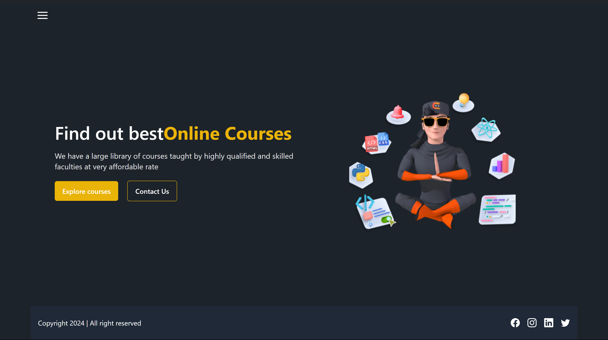
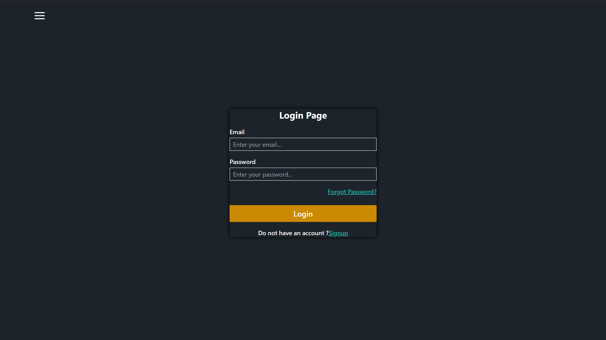
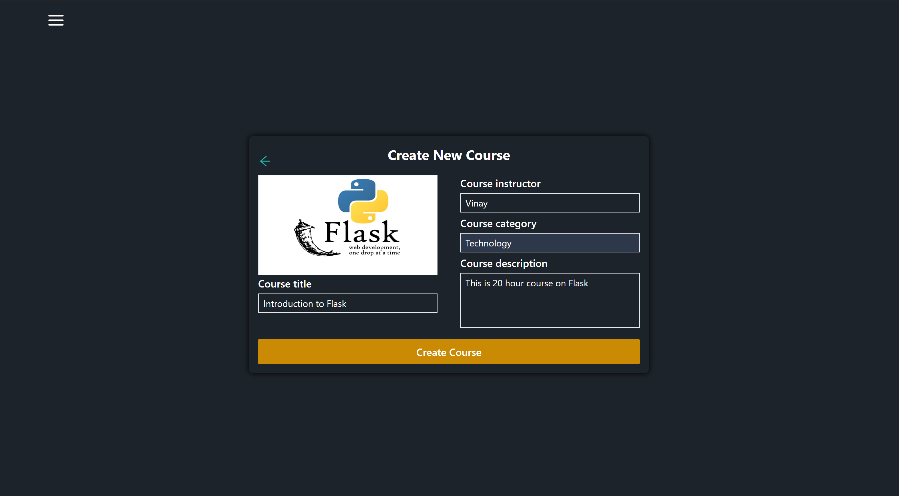
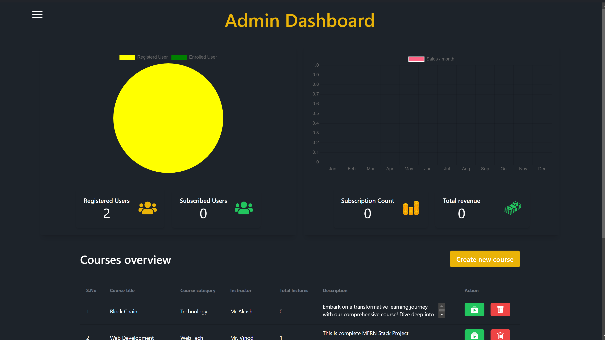

# Learning Management System (LMS)

Welcome to our Learning Management System (LMS) built using the MERN stack! This repository contains the source code for a comprehensive platform designed to facilitate online learning, course management, and administrative tasks. Whether you're an educator, student, or administrator, our LMS offers a range of features to streamline your learning experience.

## Features

### User Authentication
- **Signup:** Users can create new accounts by providing basic information.
- **Login:** Registered users can securely log in to access their accounts.
- **Authentication:** Passwords are hashed for security, and sessions are managed to ensure secure user authentication.

### Course Management
- **Course Viewing:** Users can browse and view available courses.
- **Course Enrollment:** Enrolled users can access course materials, including lectures, quizzes, and assignments.
- **Progress Tracking:** Users can track their progress within enrolled courses, including completed lectures, grades, and achievements.

### Course Purchasing
- **Subscription Plans:** Users can choose from different subscription plans based on their learning needs.
- **Payment Integration:** Secure payment gateways are integrated for seamless course purchases and subscription management.

### Admin Panel
- **User Management:** Administrators can manage user accounts, including user creation, deletion, and role assignment.
- **Course Management:** Administrators can add, edit, and delete courses, as well as manage course content and enrollment.
- **Analytics:** Detailed analytics provide insights into user activity, course popularity, and revenue generation.

## Technologies Used
- **MongoDB:** NoSQL database for storing user data, course content, and administrative information.
- **Express.js:** Node.js framework for building the backend RESTful API endpoints.
- **React.js:** Frontend library for building interactive user interfaces.
- **Node.js:** JavaScript runtime environment for server-side application logic.
- **JWT:** JSON Web Tokens for secure authentication and authorization.
- **Razorpay:** Payment processing platform for handling course purchases and subscriptions.

## Getting Started
To run the LMS locally, follow these steps:
1. Clone this repository to your local machine.
2. Navigate to the project directory and install dependencies using `npm install`.
3. Set up environment variables for database connection, JWT secret, and payment gateway API keys.
4. Start the backend server using `npm run server`.
5. Navigate to the `client` directory and start the frontend development server using `npm start`.
6. Access the application in your web browser at `http://localhost:3000`.

## Contributing
Contributions are welcome! If you'd like to contribute to this project, please follow these guidelines:
- Fork the repository and create a new branch for your feature or bug fix.
- Make your changes and ensure that they adhere to the project's coding standards and best practices.
- Test your changes thoroughly.
- Create a pull request, describing your changes and any related issues.

## License
This project is licensed under the [MIT License](LICENSE).

## Contact
For any inquiries or feedback, please contact us at [vinaychandramola123@gmail.com](mailto:vinaychandramola123@gmail.com).

Thank you for using our Learning Management System! We hope you have a great learning experience.